# <ins> How to set up SSH Access to GitHub Repo:

## How do SSH keys work?

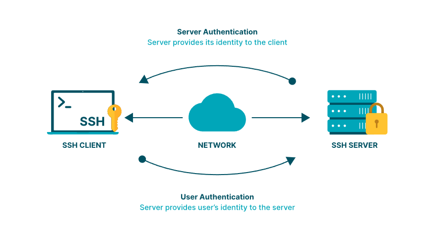

SSH key authentication is a way to prove your identity when logging into a server using a pair of keys. The public key is placed on the server, while the user keeps the private key securely.

When attempting to log in, the server uses the public key to issue a challenge. The user's computer uses the private key to respond to the challenge. If the response matches what the server expects, access is granted.


Access is denied if there is no match, ensuring security from unauthorized individuals. The SSH key pair is used to authenticate the user's or process's identity, encrypt messages, and establish a secure connection between the client and server. The challenge-response sequence happens automatically, without any manual intervention from the user.

Perfect for automation and scripts!
# <ins> Tutorial:

## Create SSH key with bash:

1. Firstly, to use an SSH key we want to create our own SSH key. To do this we must first navigate to the folder where we want to create it. This must be done in the following place:
Type the commands 
    ```
    cd
    cd .shh
    ```
    This should get to your main directory and into a folder called ssh. If there isnt one already there then use the command `mkdir .ssh` after using the `cd` command

    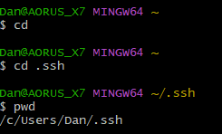

    Here I used the `pwd` command to double check I am ion the right directory <br> <br>

2. Now  we have to generate the key. We do this by using the following commands:
    ```
   ssh-keygen -t rsa -b 4096 -C "your_email@example.com"
   ```
   Replacing `your_email@example.com` with you email (keep the quotation marks) <br> <br>
*`ssh-keygen` is a built in function that creates an ssh key pair* <br> <br>
Your result should look something like this. It will ask you for a name and you can input what you like. It asks for a passcode which I just left blank. <br> <br>

    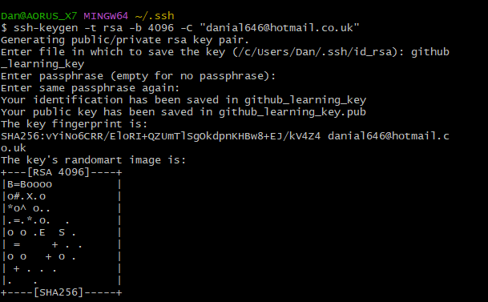 <br><br>

3. 
    We can use `ls` to see that our key has been generated. <br> We then want to use `cat` to view our public key (.pub) <br> Once you have done this you need to copy it to the clipboard (right click, copy)
 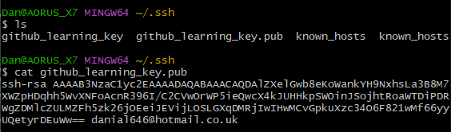 <br> <br>

4. Now we must go to our GitHub Repo that we want to use SSH with. Click *settings*.
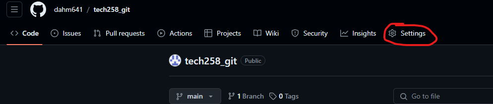 <br><br>
Then *Deploy keys* and then *Add deploy key*
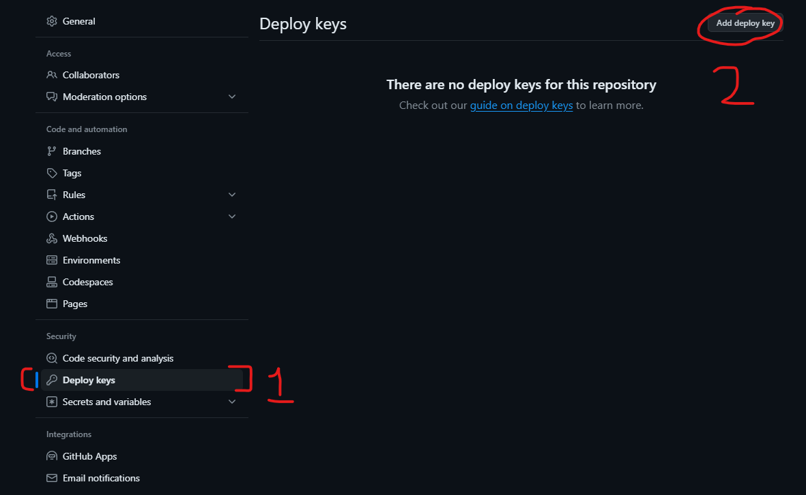
    <br><br> You will then get a screen asking you for a title and the key. Put in a title for your key and paste the public keyy you copied from step 3
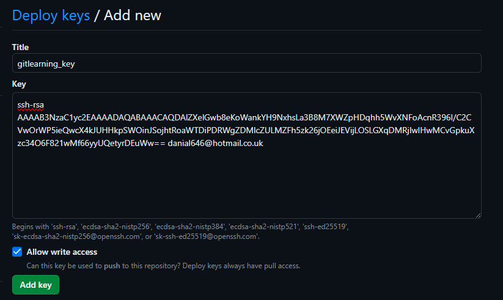 
<br> Make sure you heck the *Allow write access* box and then click *Add key* at the bottom. it will then prompt you for your login details <br> <br>
You should end up with this: <br><br>
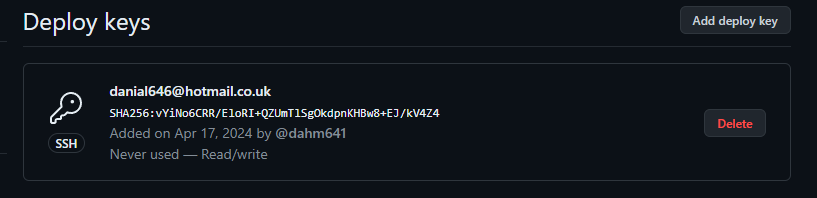
5. Once we have the key set up we need to set up the clone directory. We need to navigate to where we want to clone our GitHub Repo on our local system.
We can do this using the cd command from earlier. I will show you mine.

    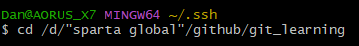 <br><br>
6. .Once in your folder we then need to use the ssh key we made earlier. Then we need to make a reference to our private key in the ~/.ssh folder. We need to use the following:
    ```
   eval `ssh-agent`
   ssh-add ~/.ssh/"your key name here"
   ```
   Replacing `"your name here"` with the name of your key and removing speech marks (***not the public one (.pub))*** <br>
This starts a process within the terminal which allows us to use a function called ssh-add which references the ssh key we want to use in **this session only.**

    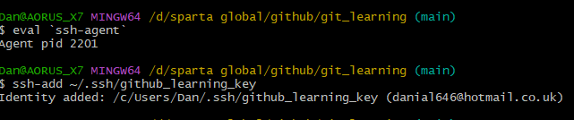 <br><br>
As you can see I had some changes that needed to be committed and pushed so I did that to keep the repos synced.
<br><br>
7. Now we must go to our repo on GitHub and get the link. <br><br>
 <br> <br>
Once we copy this we can go back to our bash shell and type the following

    ```
   git clone "your repo copied link here"
   ```
    Replacing speech marks and text with your repo name that you copied.

   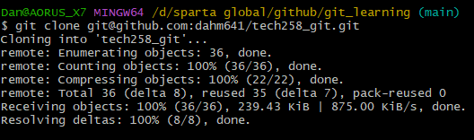

### Done!
