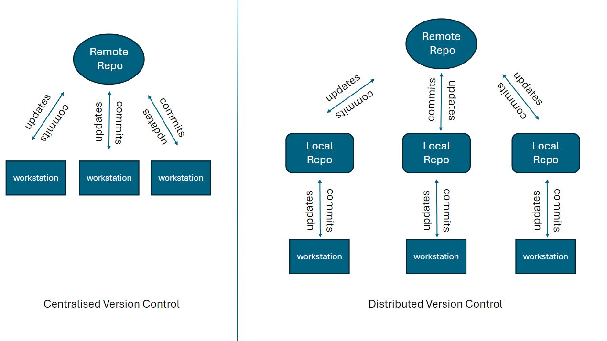

# Git learning
## What is version control?
- Version control is like a time machine for your files. It's a system that keeps track of changes you make to your documents, code, or any digital content over time. It allows you to go back to earlier versions if something goes wrong or if you want to see how things evolved. Think of it as a way to save and manage different snapshots of your work as it progresses.

## What is git and how does it work?
Git is a popular open source version control system used by developers to track changes in their code projects. It works by creating a repository, which is like a folder that holds all the files related to a project, and it keeps track of every change made to those files over time.

Here's how it works in basic terms:

- Initializing a Repository: You start by creating a Git repository in your project folder. This tells Git to start tracking changes in that folder.

- Adding Files: You add files to the repository by telling Git to start tracking them.

- Making Changes: As you work on your project, you make changes to the files in your repository.

- Committing Changes: When you're happy with the changes you've made, you "commit" them to the repository. This is like taking a snapshot of the current state of your project.

- Viewing History: You can view the history of your project and see all the changes that have been made over time.

- Branching and Merging: Git allows you to create branches, which are like separate timelines for your project. You can work on new features or fixes in a branch without affecting the main project. When you're done, you can merge your changes back into the main project.

## Basic git commands
### `git innit`
Initializes a new Git repository in the current directory, setting up the necessary files and data structures needed for version control.

### `git status`
Initializes a new Git repository in the current directory, setting up the necessary files and data structures needed for version control.

### `git add`
Adds files to the staging area, preparing them to be included in the next commit.

### `git commit`
Records the changes in the staging area to the repository's history, creating a new commit with a message describing the changes.

### `git log`
Displays a chronological list of commits in the repository, showing information such as the commit hash, author, date, and commit message. It provides a history of changes made to the project.

### `git diff`
Shows the differences between different versions of files in the repository. It highlights the changes made between the working directory and the staging area or between different commits.

### What is `git ignore` and why should we use it?
 `.gitignore` is a file we create to specify which files and folders that Git should ignore. We do this to keep the repository clean and uncluttered and it allows us to use `git add .` which means add all he files to the commit so we dont have to enter them manually due to us having to ignore some files we dont want in our git repo (saves time). 

# Film rating project
```python
### *possible film ratings are "universal", "pg", "12", "12a", "15", "18"*
`film_rating = "12a"`
### *use an if statement to check for "universal" rating*
python if film_rating == "universal":
    print("all age groups can watch this film")`
### *else check if film rating is "pg"*
`elif film_rating == "pg":
    print("General viewing, but some scenes may be unsuitable for young children.")`
### *else check if film rating is "12" or "12a"*
`elif film_rating == "12" or "12a":
    print("Films classified 12A and video works classified 12 contain material that is not generally suitable for children aged under 12. No one younger than 12 may see a 12A film in a cinema unless accompanied by an adult.")`
### *else check if film rating is "15"*
`elif film_rating == "15":
    print("No one younger than 15 may see a 15 film in a cinema.")`
### *else check if film rating is "18"*
`elif film_rating == "18":
    print("No one younger than 18 may see an 18 film in a cinema.")`
### *otherwise (none of the above) print statement*
`else:
    print("This is not a correct rating, please use universal, pg, 12, 12a, 15, 18")`
```
# Loops
## What are loops?

- Loops are programming constructs that allow you to repeat a block of code multiple times. They're handy when you need to perform the same operation over and over again.

- There are two main types of loops: ***for loops*** and ***while loops***.

### **For Loop:**
A for loop is used when you know in advance hgit commit -m ow many times you want to repeat a block of code. It's often used when you need to iterate over a sequence of elements, like a list or array.

### Example of a for loop in Python
```python    
for i in range(5): 
print("Iteration", i)'
```    
This iterates the letter i (by default increments by 1) and then prints it before iterating again

### **While Loop:** 
A while loop is used when you want to repeat a block of code as long as a condition is true. It's useful when you don't know in advance how many times you need to loop, or when the number of iterations depends on some condition.

### Example of a while loop in Python
 ```python
num = 0
while num < 5:
print("Iteration", num)
num += 1
```
- This code states that the variable `num` is equal to 0 and then states that as long as that varibale is below 5 then print the statement and what the value of the variable is. It then increments it by one. It keeps going until the statement is no longer true at which point it exits the loop

- The key difference between for and while loops is that for loops are typically used when you know the number of iterations beforehand, while while loops are used when you're not sure how many times you need to repeat the code.

- You might choose a while loop over a for loop when you want to keep iterating until a specific condition is met, which might change during the execution of the loop.

## Loop considerations

### Using loops in programming is generally safe, but there are some potential dangers and best practices to keep in mind:

- ***Infinite Loops***: One danger is accidentally creating infinite loops, where the loop condition is always true, causing the loop to run indefinitely. This can crash your program or cause it to become unresponsive.

- ***Performance***: Loops can impact the performance of your program, especially if they iterate over large amounts of data. In some cases, nested loops or inefficient looping constructs can lead to slower execution times.

- ***Code Readability***: Too many nested loops or complex loop conditions can make your code harder to understand and maintain. It's essential to write loops that are clear and easy to follow.

### To mitigate these risks and follow best practices:

- ***Ensure Loop Termination***: Always make sure that your loops have a clear termination condition to avoid infinite loops. Double-check your loop conditions and ensure they'll eventually lead to a false condtion and exit the loop.

- ***Optimize Where Possible***: If performance is a concern, consider optimizing your loops by minimizing unnecessary iterations or using more efficient loops. 

- ***Keep it Simple***: Write loops that are easy to understand and maintain. Avoid overly complex loop conditions or nesting multiple loops if possible. Clear, readable code is easier to debug and modify.

By being mindful of these considerations, you can effectively use loops in your code while minimizing potential risks and following best practices.


# Distributed Version Control
## Difference between centralised and distributed version control

centralised version control is where all commits and changes are made directly to one repository. Distributed version control is when there is a local 
repository that can sync up to the remote repository before pushing changees. This allows for less errors when pushing cloud to repositories and also local commits so you can keep working.
### What is GitHub
GitHub is a distributed version control system where users can push commits of their code to.
### GitHub Alternatives
BitBucket
## How to link a local repository to a remote repository on GitHub
### ***Prerequisites***
- Create a GitHub account
- Download and install Git Bash
- Have a directory on your local system where that you would like to set as your local repository 
- Have a repository on GitHub


1. Once you have the above we first want to use the Git Bash CLI to navigate to your folder.
we can do this by using the `cd` command.
2. Then initialise Git by using the `git init` function

 

3. After that, we want to use `git status` to see all the items want to add to our commit. If there is any we want to ignore we create 
a file called `.gitignore` and we can create this by using `nano .gitignore` and we can add files by typing them here and for directories adding a forward slash before them


4. we now must connect our local repo and our remote repo (GitHub) we can do this by using these commands replacing the text in speech marks with your personal GitHub credentials
```
git config --global user.email "youremail@yourdomain.com"
git config --global user.name "Your Username"
git remote add origin your_repo_url_here~
git branch -M your_branch_here
```
5. Once this has been established we can use `git status` to see what we want to add to the commit then use `git add` to stage whatever we want to commit (can use `git add .` to include all).
and finally we can use `git commit -m "some note about the commit"` to commit the code.
6. After this we can push it to the repo we linked earlier using `git push -u origin main` to push it to the remote repo (GitHub) we can chose the branch where it says origin. In this example
we have used the main branch.


